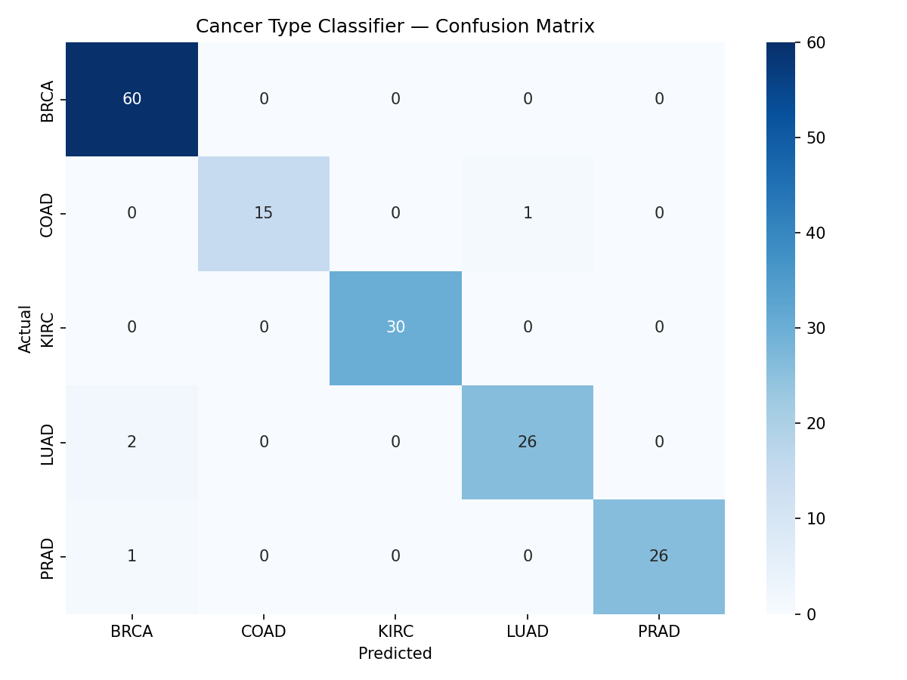
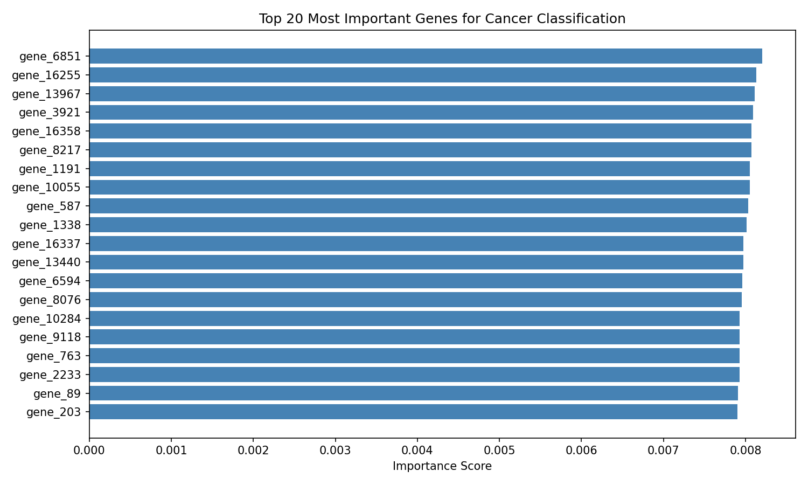

# GeneClass - Cancer type Classifier.

A machine learning project that classifies cancer types from RNA-seq gene expression profiles using the TCGA PANCAN dataset. Achieves **97.52% accuracy** includes 5 cancer types.


---

## Results

| Metric | Score |
|--------|-------|
| Test Accuracy | **97.52** |
| Macro F1-Score | 0.97 |
| Training Samples | 801 |
| Gene Features | 20,531 |

### Confusion Matrix


### Top 20 Most Important Genes


---

## Cancer Types

| Code | Cancer | F1-Score |
|------|--------|----------|
| BRCA | Breast Cancer | 0.98 |
| KIRC | Kidney Renal Clear Cell Carcinoma | 1.00 |
| LUAD | Lung Adenocarcinoma | 0.95 |
| PRAD | Prostate Adenocarcinoma | 0.98 |
| COAD | Colon Adenocarcinoma | 0.97 |

---

## Project Structure

```
cancer_classifier/
├── data/
│   ├── data.csv              # Raw gene expression (801 × 20,531) — not tracked
│   ├── labels.csv            # Cancer type labels
│   ├── data_pca.npy          # PCA-reduced features (801 × 50)
│   └── labels_clean.csv      # Cleaned labels
├── app/
│   ├── app.py                # Flask web application
│   └── templates/
│       └── index.html        # Frontend UI
├── outputs/
│   ├── confusion_matrix.png  # Evaluation graph
│   ├── gene_importance.png   # Feature importance plot
│   └── model.pkl             # Trained Random Forest model
├── requirements.txt
└── README.md
```

---

## Setup

### 1. Clone the repository

```bash
git clone https://github.com/Dhanu577/cancer-classifier.git
cd cancer-classifier
```

### 2. Install dependencies

```bash
pip install -r requirements.txt
pip install flask
```

### 3. Download the dataset

Get the dataset from [Kaggle — Gene Expression Cancer RNA-Seq](https://www.kaggle.com/datasets/crawford/gene-expression) and place both files inside the `data/` folder:

```
data/data.csv
data/labels.csv
```

### 4. Run the web app

```bash
cd app
python app.py
```

Then open your browser at:

```
http://localhost:5000
```

Click **Load Real Sample** to load a real patient's gene expression values, then click **Run Classifier** to see the prediction.

---

## ML Pipeline

```
Raw RNA-seq data (20,531 genes)
        ↓
StandardScaler normalization
        ↓
PCA reduction → 50 components (63.67% variance retained)
        ↓
Random Forest (200 estimators)
        ↓
Cancer type prediction + confidence scores
```

---

## Dataset

- **Source:** [TCGA PANCAN HiSeq dataset](https://www.kaggle.com/datasets/crawford/gene-expression)
- **Samples:** 801 tumor samples
- **Features:** 20,531 gene expression values (RNA-seq)
- **Labels:** 5 cancer types (BRCA, KIRC, LUAD, PRAD, COAD)

---

## Tech Stack

- Python 3.8+
- scikit-learn - Random Forest, PCA, StandardScaler
- pandas, numpy - data processing
- matplotlib, seaborn - visualization
- Flask — web application

---


